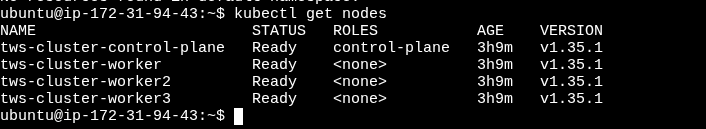

# Kubernetes
 Basic Architecture

```
-------------------------
| Master    Api Server--|
| - scheduler           |-----> multiple worker nodes which will  
| - c-m                 |          have multiple pods
| - etcd                |
-------------------------
these are controlled by kubectl 

```

## Docker must be installed
```
sudo apt-get install docker.io
sudo usermod -aG docker $USER && newgrp docker
```
## Install KIND and Kubectl
```
# For AMD64 / x86_64
[ $(uname -m) = x86_64 ] && curl -Lo ./kind https://kind.sigs.k8s.io/dl/v0.32.0/kind-linux-amd64

chmod +x ./kind
sudo mv ./kind /usr/local/bin/kind


```

##  install kubectl

```
    curl -LO "https://dl.k8s.io/release/$(curl -L -s https://dl.k8s.io/release/stable.txt)/bin/linux/amd64/kubectl"

    chmod +x ./kubectl
    sudo mv ./kubectl /usr/local/bin/kubectl


```

## Check version
```
docker --version
kind --version
kubectl version

```

### Config.yml
```yml
kind: Cluster
apiVersion: kind.x-k8s.io/v1alpha4

nodes:
  - role: control-plane
    image: kindest/node:v1.35.1
  - role: worker
    image: kindest/node:v1.35.1
  - role: worker
    image: kindest/node:v1.35.1
  - role: worker
    image: kindest/node:v1.35.1
    extraPortMappings:
    - containerPort: 80
      hostPort: 80
      protocol: TCP
    - containerPort: 443
      hostPort: 443
      protocol: TCP

```

```
    kind create cluster --name=tws-cluster --config=config.yml
  
    kubectl cluster-info --context kind-tws-cluster

    kubectl get nodes

```


cluster with control-plane (master) and worker nodes