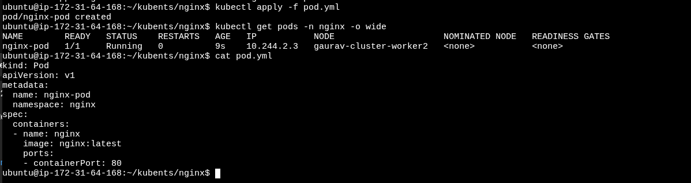
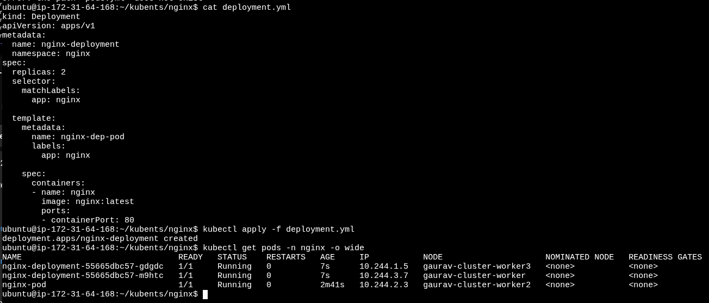
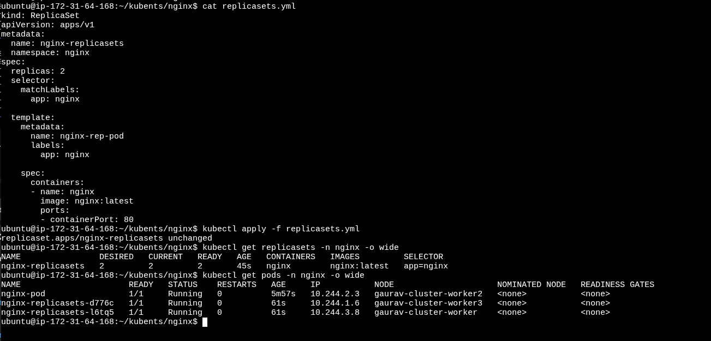
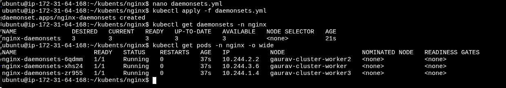
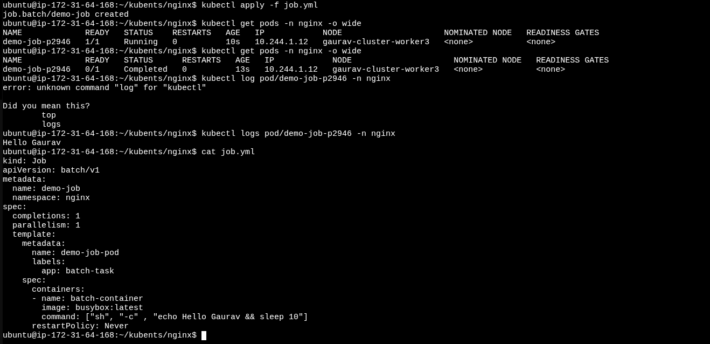

# Creating Pods, Namespace, Deployments

## Namespace
namespace is the name give to the grp
```python
kubectl get namespace
# or
kubectl get ns
```
## Creating Nginx Namespace
```
kubectl create ns nginx
```
## Get the nginx image to pod
```
kubectl run nginx --image=nginx -n nginx

kubectl get pods -n nginx
```
## Delete Pod
```
kubectl delete pod nginx -n nginx
```
## Delete Namespace
```
kubectl delete ns nginx
```
## Creating Pod , Namspace, Deployment, ReplicaSets, DaemonSets Using Manifests

### Create Namespace
[namespace.yml](namespace.yml)

```py
kubectl apply -f namespace.yml
kubectl get ns
# delete namespace
kubectl delete -f namespace.yml
```
### Create Pod
[pod.yml](pod.yml)

```py
kubectl apply -f pod.yml
kubectl get pod -n nginx
```


```py
# to exectue the pod
kubectl exec -it pod/nginx-pod -n nginx -- bash

kubectl describe pod/nginx-pod -n nginx
```

### Create Deployment
[deployment.yml]( deployment.yml)

```py
kubectl apply -f deployment.yml
kubectl get deployment -n nginx
kubectl get pod -n nginx -o wide
#scale the replicas from 2 to 5 or any no.
kubectl scale deployment/nginx-deployment -n nginx --replicas=5
#if want to roll back to prevous version
kubectl set image deployment/nginx-deployment -n nginx nginx=nginx:1.27.3
```


## Create ReplicaSet
[replicasets.yml]( replicasets.yml)

```py
kubectl apply -f replicasets.yml
kubectl get replicasets -n nginx
kubectl get pod -n nginx -o wide

```


## Create DaemonSet
[daemonsets.yml](daemonsets.yml)

```py
kubectl apply -f daemonsets.yml
kubectl get daemonsets -n nginx
kubectl get pod -n nginx -o wide

```


## Create Jobs
[job.yml](job.yml)

```py
kubectl apply -f job.yml
kubectl get job -n nginx
kubectl get pod -n nginx -o wide

```

